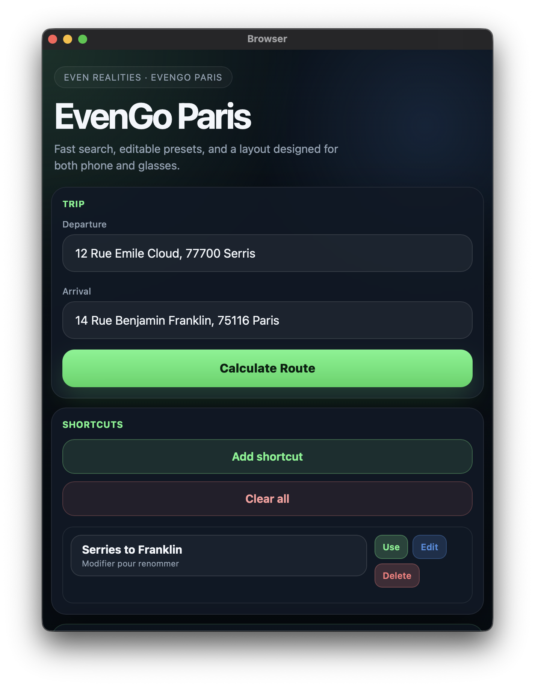

# NextStop Paris

NextStop Paris is a mobile-first companion app for [Even Realities G2](https://www.evenrealities.com/) glasses. It helps you search places, build routes for Paris public transport, save shortcuts, and push a compact itinerary view to the glasses.

The app is designed to work with the G2 glasses and the phone UI together:

- Search departure and arrival addresses from the phone
- Save reusable shortcuts
- Display route summaries, step lists, and disruption details on the glasses
- Edit the IDFM API key directly from the app

## Visual tour

Phone interface:

<table>
  <tr>
    
  </tr>
</table>

Glasses screens:

<table>
  <tr>
    <td bgcolor="#000000">
      
    </td>
  </tr>
  <tr>
    <td bgcolor="#000000">
      
    </td>
  </tr>
  <tr>
    <td bgcolor="#000000">
      
    </td>
  </tr>
  <tr>
    <td bgcolor="#000000">
      
    </td>
  </tr>
</table>

## API key setup

Get your key from the official Ile-de-France Mobilités portal:

https://prim.iledefrance-mobilites.fr/fr/mes-jetons-authentification

After creating the token, open the app on your phone, tap the API card, paste the key, and save it.

## Requirements

- Node.js 20 or newer
- An Even Realities G2 glasses device or the Even Hub simulator
- An IDFM API key from the official portal above

## Setup

```bash
npm install
```

## Development

```bash
npm run dev
```

This starts the Vite dev server for the phone UI.

## Run with the emulator

Start the simulator against your local dev server:

```bash
npx evenhub-simulator http://localhost:5173
```

## Test on real glasses (QR)

Generate a QR code that points to your machine:

```bash
npx evenhub qr --url "http://YOUR_LOCAL_IP:5173/?t=$(date +%s)"
```

Notes:

- Replace `YOUR_LOCAL_IP` with your current local IP (example: `192.168.1.123`).
- Keep `npm run dev` running while scanning the QR code in the Even app.
- The `?t=$(date +%s)` suffix helps bypass cache during quick testing iterations.

## Build

```bash
npm run build
```

This runs TypeScript checking and creates the production build in `dist/`.

## Project structure

```text
src/
  app/
    bridge/      Glasses bridge and rendering helpers
    bootstrap/   App startup, API key, web UI, and glasses event handlers
    core/        Shared app context and logging
    idfm/        IDFM API client and route search logic
    presets/     Shortcut persistence and rendering
    router/      App state machine and journey navigation
    utils/       Small shared helpers
  main.ts        Browser entry point
```

## Notes

- The app keeps the API key in browser local storage on the phone device.
- If you change the API key, reload the page to refresh the connection state.
